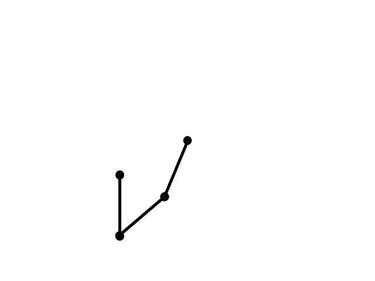

## Basics of kinematics implemented in Processing environment

### Forward kinematrics arm

Simple forward kinematics example. When you press a mouse button and move a joint in the arm, all following segments move adequately.

https://github.com/M1loseph/learning-kinematics/assets/53463658/bd749ae8-8fdc-4cb7-bafb-2ec24251595b

### Reverse kinematics worm

A virtual worm follows the `sin` function from -PI to PI, and then goes back over the `-sin` function. All segments follow one another, creating an illusion of living body. 

https://github.com/M1loseph/learning-kinematics/assets/53463658/b07d1464-3026-4799-9cb2-28a8a8dbc864

### Reverse kinematrics 2 DOF arm

Implementation of a simple reverse kinematics with arm that has two degrees of freedom. The end of a manipulator follows the circle and the two joint angles are calculated in order to achive a desired position.

https://github.com/M1loseph/learning-kinematics/assets/53463658/2c631f35-810a-41dd-9739-a84eedf868dc

### Reverse kinematics 2 DOF arm in 3D

Imeplementation of an arm with 2DOF in the vertical axis and one deggee of feedom in the horizontal one. The end of a manipulator follows a rectangle border.

https://github.com/M1loseph/learning-kinematics/assets/53463658/c8fa5bdb-dd1d-444f-aded-f1bb67281585

### Reverse kinematics 3 DOF in 2D

This time around the arm follows the mouse cursor. You can manipulate the end effector angle using a mouse wheel. This demonstration (unlike other github uploads) is simply a gif.

